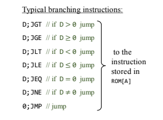

Experiencia de aprendizaje 1: Arquitectura del computador

Notas.
que hace el registro A: El registro A tiene distintas funcionas. 1: almacenauna constante. 2: Selecciona una direccion RAM.
 3: Selecciona una direccion ROM

 M es lo que contiene el registro A en ese momento en la RAM
 
 Como saltar entre ordenes en ensamblador?
 

Trabajo de investigacion
¿Qué es un computador digital moderno?
R//Un computador es una maquina que recibe, calcula, interpreta, almacena y muestra datos 
¿Cuáles son sus partes?
R//Un dispositivo de entrada para que la maquina reciba la informacion, la memoria donde la guarda, luego la pasa a la cpu y finalmente
a un dispositivo de salida o output

