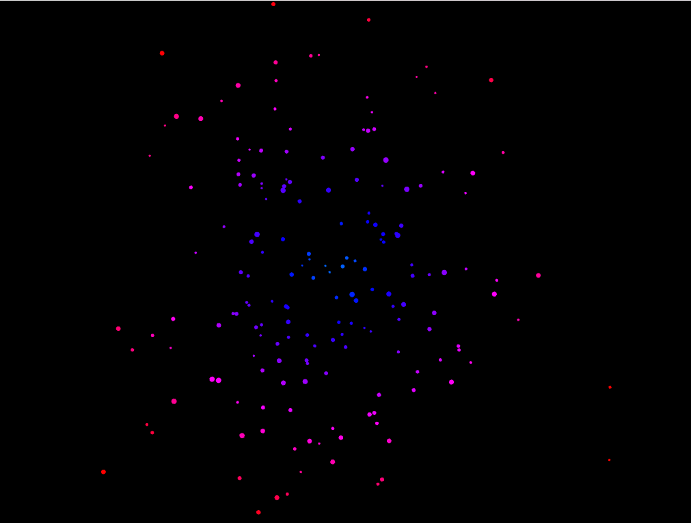

Un arte generativo en base a circulos que se ramifiquen y al alejarse del centro o realizar ciertos numeros de circulos cambien de color o alguna otra caracteristica n base a herencia 

primero algunas pruebas con un codigo experimental inicial

<video controls src="Grabación de pantalla 2025-09-25 085304.mp4" title="Title"></video>  

en base a esta prueba, y aprendiendo a aplicarla correctamente, empezaramos a jugar para acercanos al objetivo marcado 

1. logramos conseguir exactamente lo que queriamos, aunque con un resultado inesperado, la ramificacion en vez de ser estatica, se mueve de forma dinamica dando la sensacion de explosion o de galaxia, en vez de corregirlo mantendremos esto, porque me gusto mucho como se ve 

<video controls src="Grabación de pantalla 2025-09-25 093332.mp4" title="Title"></video>

agregamos un monton de funciones nuevas