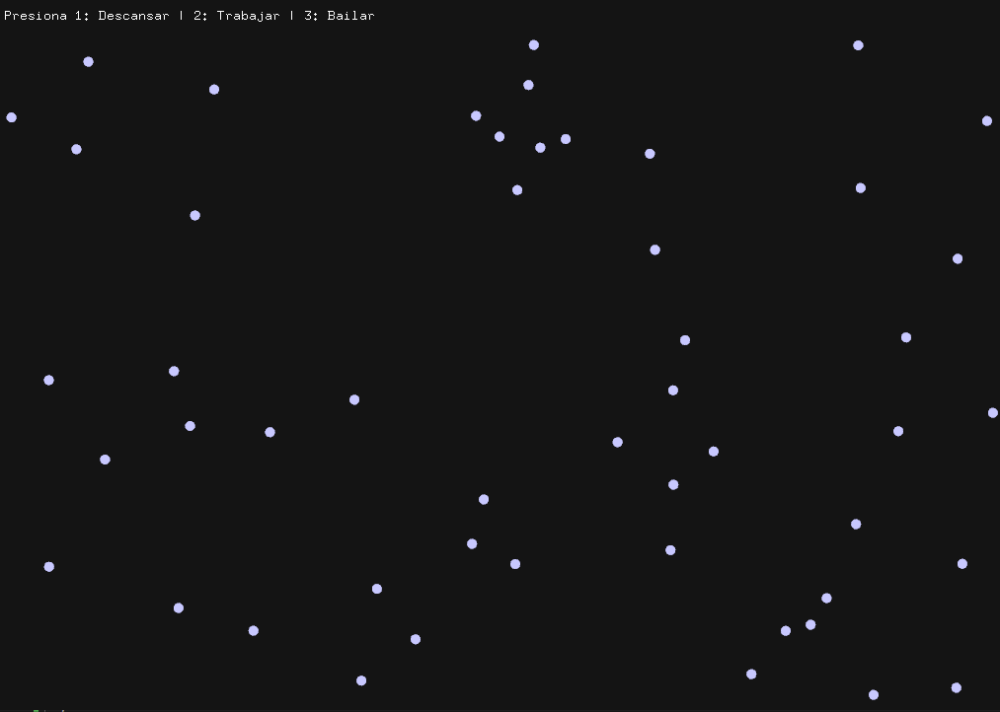
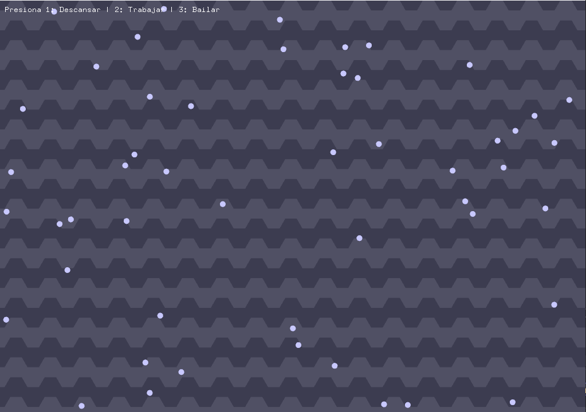
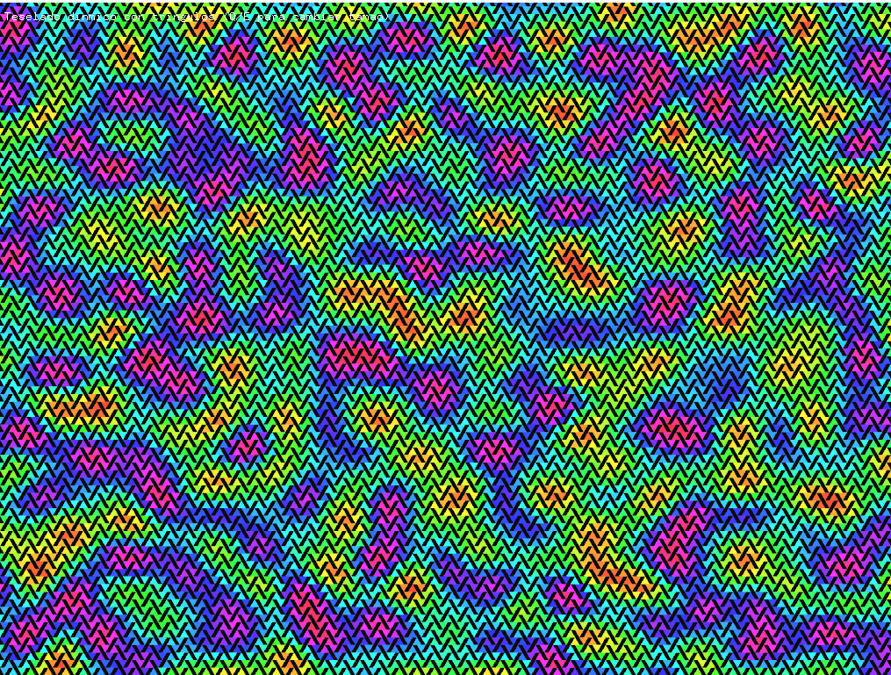
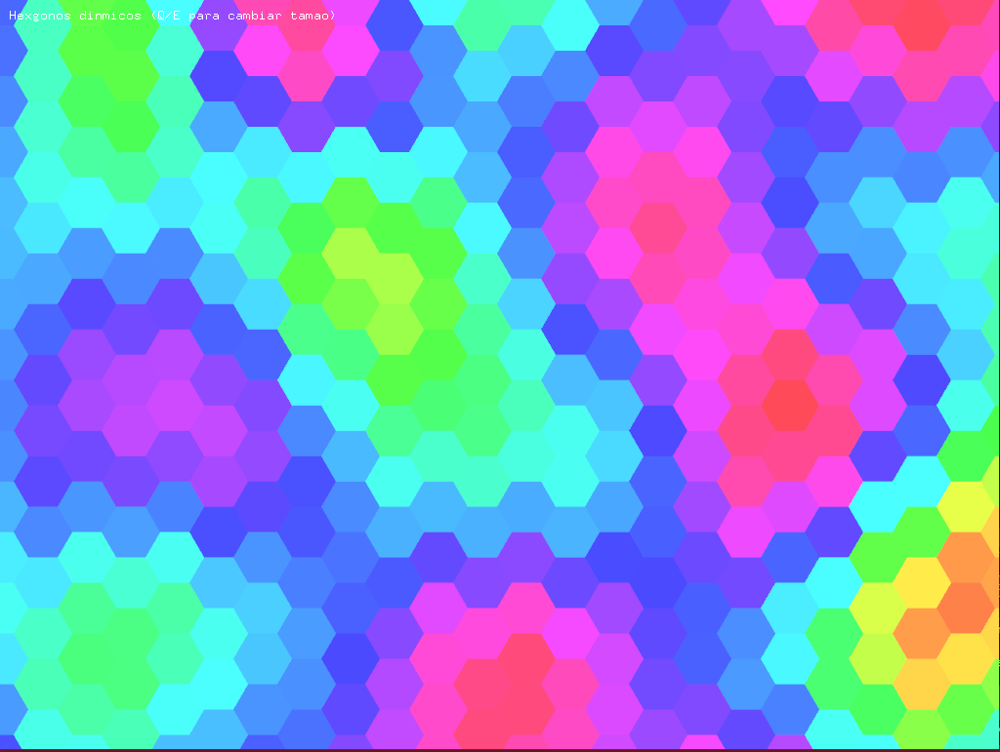

Sesion 1
analizamos el codigo, el cual presenta un programa que muestra multiples particulas de distintos tipos. podemos observar que hay eventos programados con el uso de distintas teclas 

¿Qué hace el patrón observer en este caso?

R//aunque funciona como medio para notificar a objetos especificos una orden, en este caso no realiza mucho ya que envia la orden a todos los objetos por lo que no es un cambio muy significativo 

¿Qué hace el patrón factory en este caso?

R// nos da un grupo de particulas diferentes creadas en base a un unico objeto principal 

¿Qué hace el patrón state en este caso?

R/ es lo que nos da los distintos estados o eventos que se activan con las teclas 

Entendiendo el codigo ahora vamos a experimentar con el y modificarlo 

primero añadimos un nuevo tipo de particula, la llamaremos "Moon" y sera blanca, y sera un poco mas pequeña que los planetas 

ahora crearemos un distinto tipo de estado y la tecla que lo activa. (nos ayudaremos de chat gpt para programar el estado)
este es un estado en el cual las particulas buscaran orbitar al rededor de la posicion del mouse

para este segundo caso fue un poco mas complicado, ya que a diferencia de la particula que se crea casi automaticamente con solo ponerle nombre y propiedades, el estado debe ser declarado en el .h, tambien tuvimos que asignar una tecla al mensaje "orbit" y enviar este mensaje al observador para activar el evento

entendidos estos ejemplos procederemos con el reto

# Reto
Para el reto plantearemos una colmena
empezamos con un grupo de particulas y tres estados

Empezamos a estilizarlo para que se acerque mas a nuestro concepto

el primer paso sera añadir un fondo con celdas hexagonales 

todo iba perfecto, pero el archivo se corrompio y me fue imposible volver al estado en el que estaba, y teniendo en cuenta que se parecia al caso de estudio, volveremos a iniciar con un nuevo proyexto :(

realizamos una especie de mapa de microhondas encasillado en multiples triangulos y agregamos la funcio de hacer o quitar zoom 

como extraño mi colmena, volveremos a los patrones hexagonales en honor a ella 

Ahora queremos agregar el patron state
para no volver a perder codigo, guardaremos aqui el codigo hasta ahora estable en un archivo diferente 

en el patron state crearemos los siguientes estado: normal, apagado (monocromatico) y separado. en el siguiente video se ven funcionando (y el zoom)

<video controls src="2025-10-17 14-38-04.mp4" title="Title"></video>

finalmente el patron observer y el patron fabric los añadiremos juntos. haciendo que cada hexagono sea creado en un estado aleatorio por la fabrica, y con los observadores podremos organizarlos enviando una señal a todos y volviendo a los estados ya mostrados segun queramos 

finalmente con este cambio, tenemos implementado nuestros tres patrones de diseño

aspectos a mejorar:
- en el estado caoticao inicial no se presenta el estado separado
- ya no esta implementada la funcion del zoom 
- la funcion de volver al estado caotico inicial no funciona adecuadamente y nos lleva al primer estado organizado 

Video muestra del arte:
<video controls src="2025-10-17 15-24-49.mp4" title="Title"></video>