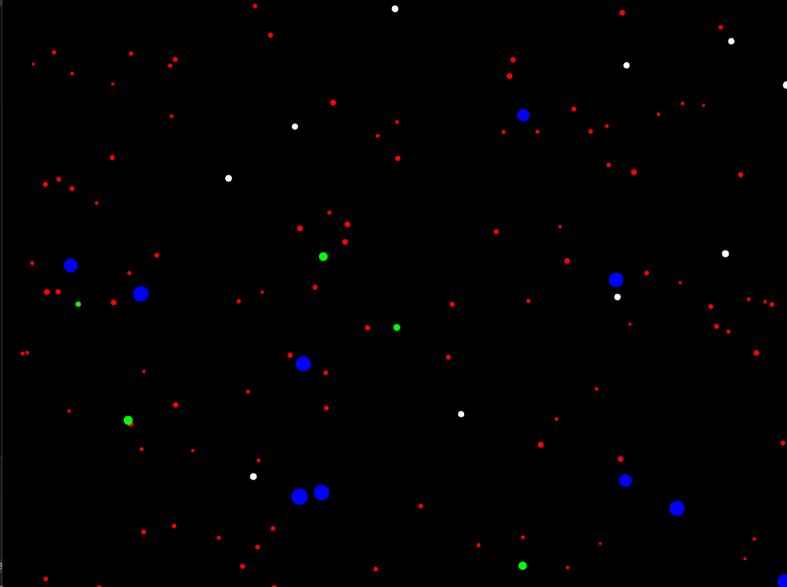
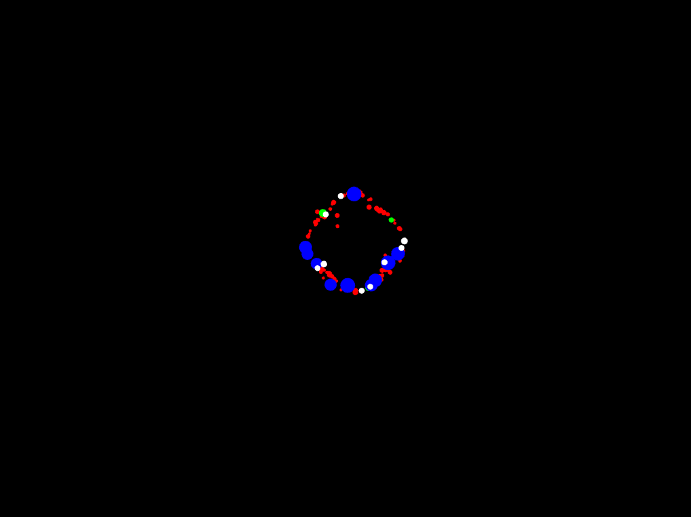

Sesion 1
analizamos el codigo, el cual presenta un programa que muestra multiples particulas de distintos tipos. podemos observar que hay eventos programados con el uso de distintas teclas 

¿Qué hace el patrón observer en este caso?

R//aunque funciona como medio para notificar a objetos especificos una orden, en este caso no realiza mucho ya que envia la orden a todos los objetos por lo que no es un cambio muy significativo 

¿Qué hace el patrón factory en este caso?

R// nos da un grupo de particulas diferentes creadas en base a un unico objeto principal 

¿Qué hace el patrón state en este caso?

R/ es lo que nos da los distintos estados o eventos que se activan con las teclas 

Entendiendo el codigo ahora vamos a experimentar con el y modificarlo 

primero añadimos un nuevo tipo de particula, la llamaremos "Moon" y sera blanca, y sera un poco mas pequeña que los planetas 

ahora crearemos un distinto tipo de estado y la tecla que lo activa. (nos ayudaremos de chat gpt para programar el estado)
este es un estado en el cual las particulas buscaran orbitar al rededor de la posicion del mouse

para este segundo caso fue un poco mas complicado, ya que a diferencia de la particula que se crea casi automaticamente con solo ponerle nombre y propiedades, el estado debe ser declarado en el .h, tambien tuvimos que asignar una tecla al mensaje "orbit" y enviar este mensaje al observador para activar el evento