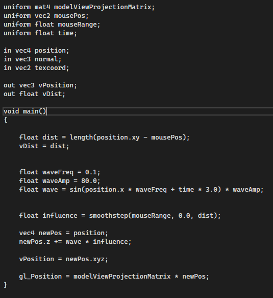
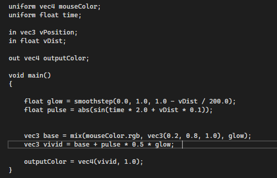
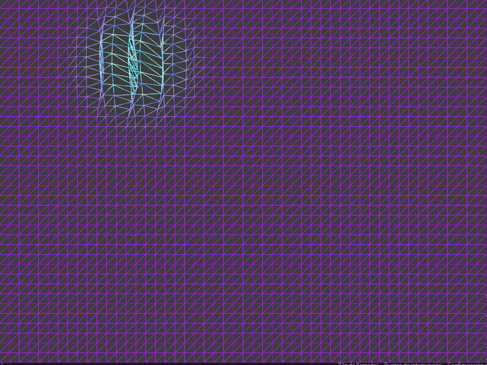
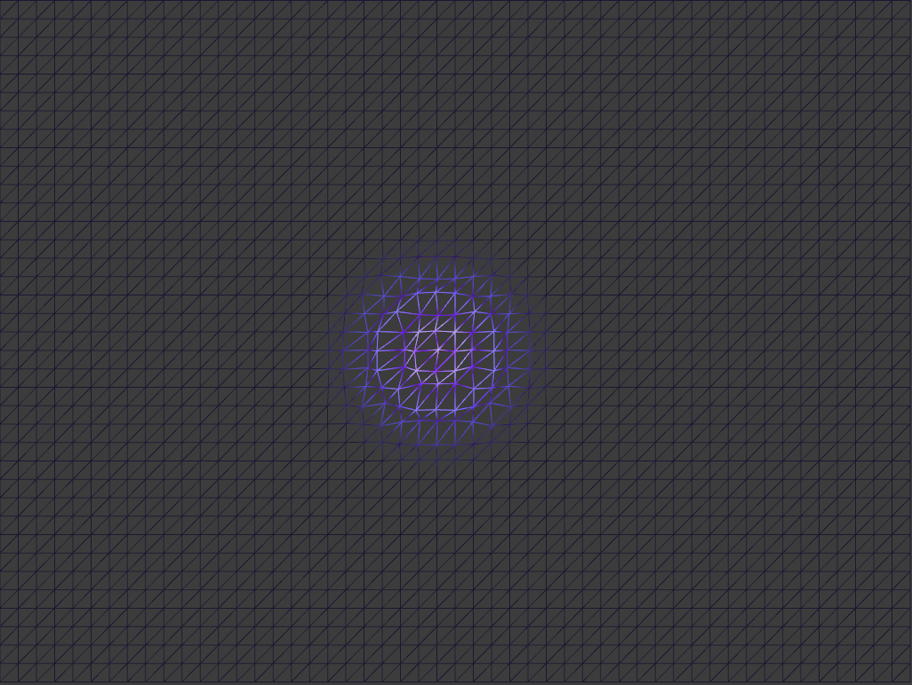
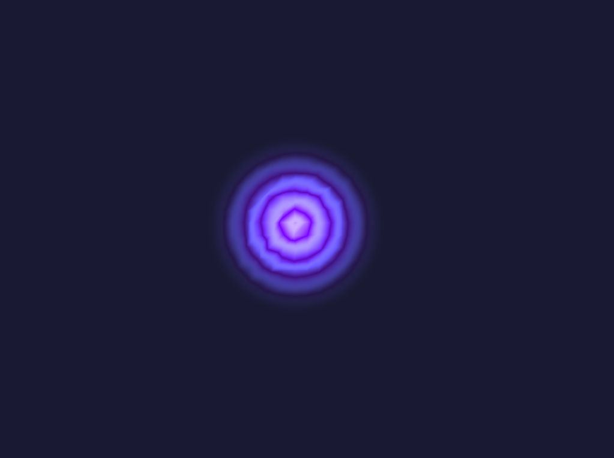

## Reto Shaders 
Para el reto comenzaremos utilizando la base del ejemplo #2 en el cual pasamos el cursor por encima de una malla y esta expande los vertices para formar una burbuja. modificaremos la expansion con otro tipo de deformacion, unba que forma ondas

## Desarrollo
la primera prueba salio muy cercano a lo esperado, ondulacion en forma de ondas, sin embargo son poco visibles, asi que corregiremos las ondas en .vert y los colores en .frag para hacerlas mas visibles 

### .Vert

### .Frag

con esto, tenemos un resultado perfecto que coincide con nuestra idea inicial 

el nivel de deformacion aumenta o disminuye segun que tan lejos se encuentre el mouse del centro de la malla y con el cambio de color al rededor de la deformacion, se hace mucho mas visible 

bueno, sinceramente estoy asombrado de lo rapido que fue, normalmente tardo y me salen mas problemas a la hora de querer hacer un reto, asi que vamos a terminar de mejorarlo 

empezamos por mejorar la deformacion de los vertices para que se acerque mas a una onda de agua 

tambien cambiamos nuevamente los colores para hacerlo mas visible 

finalmente cambiamos la malla por un plano para que se vea mas bonito y nos queda asi:

## Explicacion

en el .vert se esta esta manejando la deformacion de los vertices al rededor del mouse, como la amplitud de la onda, la frecuencia con ayuda del medidor de tiempo "time"

la influencia al rededor del mouse que mide hasta donde afectara o aparecera este circulo que crea las ondas 

en el .frag declaramos los colores con los que se intan estos vectores 

por ultimo cambiamos en el draw plane.drawwireframe a simplemente .draw ya nos da ese bonito aspecto de plano en vez de malla

en el .cpp no hay casi ningun cambio respecto al ejemplo original que solo generaba un semicirculo

asi logramos modificar el ejemplo inicial dandole un aspecto mas interesante y actractivo manteniendo las bases 

## Video demostrativo 

<video controls src="2025-11-03 21-57-51.mp4" title="Title"></video>